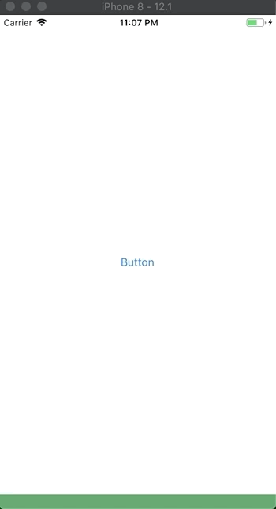

# XBottomSheet

## Build Status

| XBottomSheet.Touch  | XBottomSheet.Droid | .Touch.Sample  | .Droid.Sample |
| ------------- | ------------- | ------------- | ------------- |
|||||

## Setup 

On client projects install the nuget XBottomSheet ([](https://www.nuget.org/packages/XBottomSheet/)) and then follow the steps based on platform:

### iOS

#### Standard

1. Create a new ViewController of type BottomSheetViewController within the ViewController that you want to add it to:

```
public override void ViewDidLoad()
{
    base.ViewDidLoad();
    var bottomSheetViewController = new BottomSheetViewController(100, 300, 500, true, BottomSheetState.Bottom);
}
```
For more details on options for the constructors or their parameters, please check the implementation.

2. Add the newly created ViewController as a child to the current one:

```
    AddChildViewController(bottomSheetViewController);
    View.AddSubview(bottomSheetViewController.View);
    bottomSheetViewController.DidMoveToParentViewController(this);
```

3. Define the Frame for the View of the BottomSheet control: 

```
    bottomSheetViewController.View.Frame = new CGRect(0, View.Frame.GetMaxY(), View.Frame.Width, View.Frame.Height);
```

4. Add your custom view within as until now it would be only a blue view that can be dragged around:

```
    customView = CustomView.Create();
    customView.Frame = View.Frame;
    bottomSheetViewController.SetCustomView(customView);
```

#### MvvmCross

After following the steps from previous way, continue with following:

1. As you can add any control within that custom view, in order to make it available for binding, you have to create a public geter/setter for it, similar to this:

```
    public UILabel CustomValue
    {
        get
        {
            return lbCustomValue;
        }
        set
        {
            lbCustomValue = value;
        }
    }
```
2. Within the MainViewController (or parent view controller) create a binding set between the controls that you have in the custom view and the view model associated with the parent view controller:

```
    var set = this.CreateBindingSet<MainViewController, MainViewModel>();
    set.Bind(customView.CustomValue).For(t => t.Text).To(vm => vm.CustomValue);
    set.Apply();
```

Check the Touch.MSample for actual sample on how a value is passed in between.

### Android

#### Standard
1. You can use this view by adding it within your layout:

```
   <XBottomSheet.Droid.Views.XBottomSheetView
	android:id="@+id/BottomSheet"
	app:anchorOffset="320dp"
	app:peekHeight="192dp"
	app:defaultState="collapsed"
	android:layout_width="match_parent"
	android:layout_height="match_parent">
   </XBottomSheet.Droid.Views.XBottomSheetView>
```
2. In order to use a custom view you will need to inflate a desired Android layout file (ex. CustomView.axml) and assign it to the ContentView property of XBottomSheetView:

```
    var bottomSheetView = FindViewById<XBottomSheetView>(Resource.Id.BottomSheet);
    var customView = LayoutInflater.Inflate(Resource.Layout.CustomView, null);
    
    bottomSheetView.ContentView = customView;
    bottomSheetView.BackgroundColor = Color.Transparent;
```

#### MvvmCross

After following previous steps, in order to bind the ViewModel with your CustomView you'll need to replace LayoutInflater.Inflate with BindingInflate

```
   var customView = this.BindingInflate(Resource.Layout.CustomView, null);
```

## Demo

### iOS



### Android

## Known issues/difficulties

- If you add this controll with **GMSMapView** or other similar feature that has its own gesture management it is possible to prevent XBottomSheet to trigger the **PanGesture** method, even if it registers it. For GMSMapView, the fix is to have "**mapView.Settings.ConsumesGesturesInView = false;**", where mapView is your GMSMapView object.

## Conclusion

### If you have a question or a suggestion, please add an issue and we'll discuss over it. We're open to respond, add new features, fine tune our solutions or, last, but most important, to fix bugs/problems that you encounter. 
#### As you've got this far and our code might helped you, support us to build more content like this through: 
<a href="https://www.buymeacoffee.com/grendio" target="_blank"></a>
